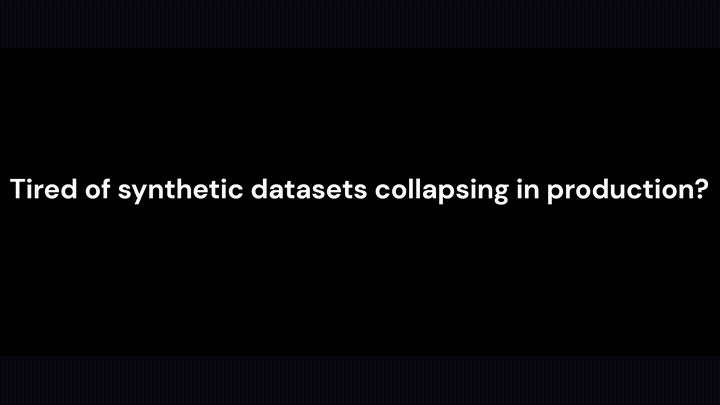

# Enterprise Synthetic Datasets (Strict JSONL)

*15s demo — strict JSONL structure, 7-point rubric validation (click for MP4).*

Structured synthetic datasets for enterprise LLM alignment.
All datasets follow deterministic schema and multi-turn consistency.

## Datasets
| Dataset | Schema | Samples | Trial (HF) | Full (Gumroad) |
|---|---|---|---|---|
| [mcp-agent-trajectory](mcp-agent-trajectory/) | [schema](mcp-agent-trajectory/schema.json) | [samples](mcp-agent-trajectory/samples/) | [HF](https://huggingface.co/datasets/springofwindslabs/mcp-agent-trajectory-benchmark) | [Gumroad](https://springofwindslabs.gumroad.com/l/mcp-agent-trajectory) |
| [function-calling-en](function-calling-en/) | [schema](function-calling-en/schema.json) | [samples](function-calling-en/samples/) | [HF](https://huggingface.co/datasets/springofwindslabs/function-calling-en-trial) | [Gumroad](https://springofwindslabs.gumroad.com/l/function-calling-en) |
| [function-calling-ja](function-calling-ja/) | [schema](function-calling-ja/schema.json) | [samples](function-calling-ja/samples/) | [HF](https://huggingface.co/datasets/springofwindslabs/function-calling-ja-trial) | [Gumroad](https://springofwindslabs.gumroad.com/l/function-calling-ja) |
| [regulatory-compliance-cot](regulatory-compliance-cot/) | [schema](regulatory-compliance-cot/schema.json) | [samples](regulatory-compliance-cot/samples/) | [HF](https://huggingface.co/datasets/springofwindslabs/regulatory-compliance-cot-trial) | [Gumroad](https://springofwindslabs.gumroad.com/l/regulatory-compliance-cot) |

## Structure
- Strict JSONL
- Deterministic schema
- Error recovery included
- Token-efficient formatting

## What the free trial verifies

Each 50-row HF trial exists to let you confirm three things on your own stack **before** buying:

1. **Schema integrity** — strict JSONL, matches the published `schema.json`
2. **Multi-turn / tool-use behavior** — role sequences, tool definitions, argument structure
3. **CoT step structure** — ordered `reasoning_steps` + explicit conclusion (CoT dataset)

Reproducible recipes (metrics script, Axolotl smoke-test config, Unsloth loading check):
➔ **[evaluation/](evaluation/)**

## Guarantees vs. non-guarantees

| Guaranteed (verifiable from the data) | Not guaranteed |
|---|---|
| Strict JSONL (1 row = 1 valid JSON) | Any specific performance uplift for a given model |
| Conformance to published `schema.json` | Legal compliance of your deployment in any jurisdiction |
| Multi-turn role-sequence consistency | Exhaustive coverage of all regulatory texts |
| `tools` / arguments structural integrity | |
| `reasoning_steps` format integrity (CoT) | |
| Zero row overlap across lots (hash / ID / 3-gram audited) | |

## Commercial tiers (full versions)

| Dataset | 1K Standard | 2K Extended (incl. 1K, 3,300+ total rows) | Notes |
|---|---|---|---|
| MCP Agent Trajectory | $7,300 | $13,200 | multi-turn trajectories, error-recovery sequences (403 / 429 / locks) |
| Function Calling EN | $6,400 | $11,400 | multi-turn tool calls, strictly-typed JSON arguments |
| Function Calling JA | $8,500 | $15,300 | native-Japanese tool routing, honorifics / high-context |
| Regulatory Compliance CoT | $12,500 | $22,500 | step-by-step compliance reasoning, auditable CoT traces |

All tiers: perpetual, organization-wide commercial license - one-time purchase - `SHA256SUMS.txt` included - tiers are mutually exclusive (zero overlapping rows). Full license terms on each Gumroad page.

## Samples
Each dataset directory includes a `samples/` folder with 5-row previews.

## Trial Versions
Available on Hugging Face:
https://huggingface.co/springofwindslabs

## Full Versions
Available on Gumroad:
https://springofwindslabs.gumroad.com

## Get Started: Trial → Full

| Step | What you get | Link |
|---|---|---|
| 1. **Validate free** | 50-row trial per dataset (Apache-2.0, no gating) | [Hugging Face](https://huggingface.co/springofwindslabs) |
| 2. **Inspect schema** | `schema.json` + 5-row samples in this repo | [Datasets table above](#datasets) |
| 3. **Go production** | 1,000+ row volumes, perpetual commercial license, instant delivery | [Gumroad](https://springofwindslabs.gumroad.com?utm_source=github&utm_medium=readme_funnel&utm_campaign=springofwinds-datasets) |

Questions before purchase? → springofwinds@gmail.com

## Changelog
See [CHANGELOG.md](CHANGELOG.md) for dataset and repository updates.

## License
Apache-2.0

---

### Enterprise Procurement
For licensing, corporate invoicing, procurement review, or custom commercial agreements:
✉️ springofwindslabs@gmail.com
